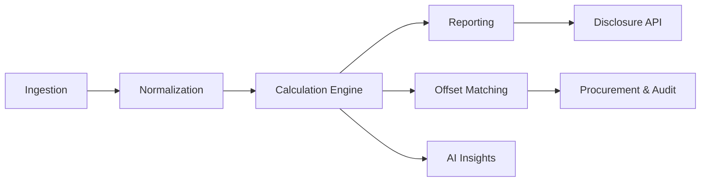

# 🌏 EcoLedger

> **AI-powered carbon accounting and reporting platform**  
> Transparent, audit-ready, and aligned with Climate Active & ASRS standards.

---
## 💡 Tagline

“EcoLedger – AI-powered carbon accounting for a transparent net-zero journey.”

## ✨ Overview

EcoLedger is a **modular, multi-tenant carbon accounting platform** tailored for Australian SMEs.  
It helps businesses simplify and automate their emissions tracking across **Scope 1, 2, and 3**, while staying compliant with **Climate Active** and upcoming **Australian Sustainability Disclosure Standards (ASRS)**.

With **AI-powered estimation, verifiable offsets, and audit-ready reporting**, EcoLedger makes net-zero compliance **faster, cheaper, and more transparent**.

---

## 🔑 Features

- 📊 **Carbon Accounting** – Track Scope 1, 2, and 3 emissions.  
- 🧩 **Modular Microservices** – Built with a multi-tenant, event-driven architecture.  
- 🧠 **AI Estimation** – Fill data gaps with smart predictions.  
- 🔗 **Offset Matching** – Identify and allocate eligible ACCUs and offsets.  
- 📑 **Audit-ready Reports** – Climate Active and ASRS-compliant reports.  
- 🤝 **Collaboration Tools** – Onboarding wizard, approvals, and task assignments.  
- 🛡️ **Secure IAM** – Role-based access control, JWT authentication, tenant isolation.  
- ⚡ **Integrations** – Connect to ERP, utility, IoT, and financial systems.  

---

## 🏗️ Architecture

EcoLedger follows a **microservices architecture**, with services for:

- **Tenant & IAM** – multi-tenant identity, orgs, RBAC.  
- **Ingestion & Normalization** – connectors, ETL, data quality.  
- **Calculation Engine** – Scope 1–3 calculators, uncertainty handling.  
- **Offset & Verification** – registry, matching, procurement, audit trail.  
- **Reporting** – Climate Active & ASRS-compliant disclosures.  
- **AI & Insights** – estimation, forecasting, reduction opportunities.  

## 🚀 Technology Stack

- **Backend**: Python 3.11+, FastAPI (modular microservices)  
- **Database**: PostgreSQL 14+ (relational data, multi-tenant schemas)  
- **Caching & Queues**: Redis (session caching, task queues, pub/sub events)  
- **AI/ML**: PyTorch (deep learning for estimation & forecasting)  
- **Frontend**: Next.js + TailwindCSS (responsive, modern dashboard)  
- **DevOps**: Docker & Docker Compose (containerized services)  

📦 Roadmap

 Multi-tenant IAM with RBAC

 Scope 1–3 calculation engine

 Offset procurement & certificate tracking

 AI-driven data estimation & forecasting

 Climate Active + ASRS disclosure API

 Marketplace for carbon offsets

 📜 License

EcoLedger is released under the MIT License.

## Services

### 🔑 Core domain & tenancy

    Tenant & Org Service → Ensures multi-tenant isolation, secure org-level data boundaries.

    IAM (Identity & Access) → Provides secure authentication & role-based access.

    Billing & Plans → Enables SaaS monetization via usage-based billing.

    Settings & Schema → Supports per-tenant customization and flexible sector mapping.

| Service                     | Purpose                                                    | Example APIs                                 | Storage        | Events (pub/sub)                                       |
| --------------------------- | ---------------------------------------------------------- | -------------------------------------------- | -------------- | ------------------------------------------------------ |
| **Tenant & Org Service**    | Multi-tenant boundaries, orgs, workspaces, members, roles. | `POST /tenants`, `GET /orgs/{id}`            | Postgres       | **Pub:** `tenant.created`, `org.member.added`          |
| **IAM (Identity & Access)** | Auth (JWT/OIDC), RBAC/ABAC, service-to-service tokens.     | `POST /auth/login`, `GET /me`, `POST /roles` | Postgres/Redis | **Sub:** `tenant.created`                              |
| **Billing & Plans**         | Subscriptions, metering, invoices, usage quotas.           | `POST /plans`, `GET /usage`                  | Postgres       | **Pub:** `usage.recorded`; **Sub:** `report.generated` |
| **Settings & Schema**       | Per-tenant feature flags, units, material taxonomies.      | `GET /settings`, `PUT /features`             | Postgres       | **Pub:** `settings.updated`                            |

### 📥 Data intake & normalization

        Connector Hub → Lets businesses connect to ERP, utilities, IoT with minimal setup.

        Ingestion Service → Automates upload of invoices, bills, and sensor data.

        Data Modeling & ETL → Converts raw data into standardized carbon activity models.

        Data Quality & Lineage → Builds trust by ensuring accuracy and traceability of data.

| Service                    | Purpose                                                      | Example APIs                         | Storage                                 | Events                                                         |
| -------------------------- | ------------------------------------------------------------ | ------------------------------------ | --------------------------------------- | -------------------------------------------------------------- |
| **Connector Hub**          | OAuth/connectors to ERPs, utilities, fleet/IoT, POS, cloud.  | `POST /connections`, `GET /sources`  | Postgres                                | **Pub:** `ingest.job.scheduled`                                |
| **Ingestion Service**      | Batch/stream ingestion, file uploads, schema mapping.        | `POST /imports`, `POST /files`       | S3/Blob + Postgres                      | **Pub:** `raw.record.received`                                 |
| **Data Modeling & ETL**    | Normalize to canonical activity model (energy, fuel, spend). | `POST /normalize/run`                | Warehouse (BigQuery/Snowflake/Postgres) | **Pub:** `activity.normalized`; **Sub:** `raw.record.received` |
| **Data Quality & Lineage** | Validation rules, anomaly detection, lineage graph.          | `GET /dq/rules`, `GET /lineage/{id}` | Neo4j/Graph DB + Postgres               | **Pub:** `dq.alert.raised`; **Sub:** `activity.normalized`     |

## ⚖️ Emissions factors & calculation

        Factor Registry → Maintains version-controlled emissions factors (e.g., NGA factors, ACCUs).

        Calculation Engine → Accurately computes Scope 1–3 emissions with transparency.

        Scenario & Forecasting → Models future emissions pathways and reduction options.

| Service                    | Purpose                                                   | Example APIs                                     | Storage           | Events                                                                                          |
| -------------------------- | --------------------------------------------------------- | ------------------------------------------------ | ----------------- | ----------------------------------------------------------------------------------------------- |
| **Factor Registry**        | Versioned emissions factors (national, sectoral, custom). | `GET /factors?scope=2&region=AU`                 | Postgres          | **Pub:** `factor.version.released`                                                              |
| **Calculation Engine**     | Scope 1/2/3 calculators, period aggregation, uncertainty. | `POST /calc/run`, `GET /calc/{jobId}`            | Warehouse + Cache | **Pub:** `emission.batch.calculated`; **Sub:** `activity.normalized`, `factor.version.released` |
| **Scenario & Forecasting** | What-if, marginal abatement, target pathways.             | `POST /scenarios`, `GET /scenarios/{id}/results` | Warehouse         | **Pub:** `scenario.result.ready`; **Sub:** `emission.batch.calculated`                          |

### 🌱 Offsets & verification

    Offset Catalog → Provides access to verified carbon offset projects (incl. ACCUs).

    Offset Matching → Suggests best-fit offsets for residual emissions.

    Procurement & Settlement → Facilitates purchase, settlement, and certification of offsets.

    Verification & Audit Trail → Ensures compliance with immutable audit logs and evidence.

| Service                        | Purpose                                                     | Example APIs                             | Storage                          | Events                                                                                             |
| ------------------------------ | ----------------------------------------------------------- | ---------------------------------------- | -------------------------------- | -------------------------------------------------------------------------------------------------- |
| **Offset Catalog**             | ACCUs + trusted offsets registry, prices, availability.     | `GET /offsets?method=ACCUs`              | Postgres                         | **Pub:** `offset.inventory.updated`                                                                |
| **Offset Matching**            | Match residual emissions to offsets (rules/AI ranking).     | `POST /match`, `GET /match/{id}`         | Postgres                         | **Pub:** `offset.match.proposed`; **Sub:** `emission.batch.calculated`, `offset.inventory.updated` |
| **Procurement & Settlement**   | Reserve/purchase offsets, invoices, certificates.           | `POST /orders`, `GET /certificates/{id}` | Postgres                         | **Pub:** `offset.order.settled`; **Sub:** `offset.match.proposed`                                  |
| **Verification & Audit Trail** | Evidence vault, signatures, attestations, audit log (WORM). | `POST /evidence`, `GET /audit/logs`      | Object storage + Append-only log | **Pub:** `evidence.added`, `attestation.signed`; **Sub:** `report.generated`                       |

### 📑 Reporting & compliance

        Reporting Service → Generates Climate Active & ASRS-compliant audit-ready reports.

        Disclosure API → Automates submission to regulators and certifiers.

        Labeling & Badging → Grants carbon-neutral badges and public disclosures for businesses.

| Service                | Purpose                                             | Example APIs                                 | Storage        | Events                                                            |
| ---------------------- | --------------------------------------------------- | -------------------------------------------- | -------------- | ----------------------------------------------------------------- |
| **Reporting Service**  | Climate Active & ASRS-ready reports, period close.  | `POST /reports/run`, `GET /reports/{id}.pdf` | Warehouse + S3 | **Pub:** `report.generated`; **Sub:** `emission.batch.calculated` |
| **Disclosure API**     | Regulator/certifier data feeds, XBRL/ASRS payloads. | `POST /disclosures/asrs`, `GET /status/{id}` | Postgres       | **Pub:** `disclosure.submitted`; **Sub:** `report.generated`      |
| **Labeling & Badging** | “Carbon neutral”, target progress, public pages.    | `GET /badges/{org}`, `GET /public/{slug}`    | Postgres/Cache | **Sub:** `report.generated`, `attestation.signed`                 |

### 🤖 Intelligence & automation

    AI Estimation → Fills data gaps with ML-based inference to reduce manual input.

    Agent Orchestrator → Automates workflows (onboarding, reporting, audits).

    Insights & Alerts → Surfaces emission hotspots, trends, and reduction opportunities.

| Service                | Purpose                                                   | Example APIs                           | Storage                   | Events                                                           |
| ---------------------- | --------------------------------------------------------- | -------------------------------------- | ------------------------- | ---------------------------------------------------------------- |
| **AI Estimation**      | Infer missing activity data (e.g., spend→emission class). | `POST /estimate`, `GET /estimate/{id}` | Feature store + Vector DB | **Pub:** `activity.estimated`; **Sub:** `dq.alert.raised`        |
| **Agent Orchestrator** | Multi-step agents for onboarding, month-end close.        | `POST /agents/run?workflow=onboarding` | Postgres                  | **Pub:** `agent.step.completed`; **Sub:** `ingest.job.scheduled` |
| **Insights & Alerts**  | Hotspots, trends, reduction opportunities.                | `GET /insights`, `POST /alerts/rules`  | Warehouse                 | **Pub:** `insight.created`; **Sub:** `emission.batch.calculated` |

## 👥 Experience & collaboration

        Onboarding Wizard → Simplifies setup for SMEs with guided questions.

        Tasks & Workflow → Assigns roles, approvals, and action tracking for compliance.

        Notifications → Delivers real-time alerts via email, SMS, Slack, or Teams.

        Document Service → Centralizes storage of evidence, policies, and certificates.

| Service               | Purpose                                             | Example APIs                                | Storage     | Events                                                |
| --------------------- | --------------------------------------------------- | ------------------------------------------- | ----------- | ----------------------------------------------------- |
| **Onboarding Wizard** | Guided setup: sectors, scopes, connectors, targets. | `POST /wizard/answers`, `GET /wizard/state` | Postgres    | **Sub:** `agent.step.completed`                       |
| **Tasks & Workflow**  | Assign tasks, approvals, SLAs, checklists.          | `POST /tasks`, `POST /approvals`            | Postgres    | **Pub:** `task.completed`; **Sub:** `dq.alert.raised` |
| **Notifications**     | Email/SMS/Slack; digest scheduling.                 | `POST /notify`, `POST /subscriptions`       | Redis/Queue | **Sub:** events across domain                         |
| **Document Service**  | Policies, supporting docs, templates.               | `POST /docs`, `GET /docs/{id}`              | S3/Blob     | **Sub:** `report.generated`                           |

### ⚙️ Platform & ops

        API Gateway / BFF → Provides secure, tenant-aware access to all services.

        Audit & Observability → Ensures transparency with logs, metrics, and monitoring.

        Secrets & KMS → Protects sensitive data with encryption and key management.

        Schema Registry & Events → Guarantees reliable, consistent data exchange across services.

| Service                      | Purpose                                           | Example APIs                         | Storage        | Events              |
| ---------------------------- | ------------------------------------------------- | ------------------------------------ | -------------- | ------------------- |
| **API Gateway / BFF**        | Edge routing, rate limits, tenant resolution.     | `GET /v1/*`                          | N/A            | N/A                 |
| **Audit & Observability**    | Central logs, traces, metrics, security audit.    | `GET /healthz`, `GET /audit/queries` | ELK/OTel store | **Sub:** everything |
| **Secrets & KMS**            | Key mgmt, encryption, signature, HSM integration. | `POST /sign`, `POST /encrypt`        | HSM/KMS        | N/A                 |
| **Schema Registry & Events** | Avro/JSON schema, topic registry, replay.         | `GET /schemas`, `POST /topics`       | Registry DB    | N/A                 |

🌏 EcoLedger — Benefits by Theme
✅ Compliance & Trust

Accurate Scope 1–3 Tracking → Ensures Climate Active & ASRS compliance.

Audit-ready Reports → Instant generation of regulator-accepted disclosures.

Immutable Audit Trail → Verifiable logs for regulators, auditors, and certifiers.

Offset Verification → Access to verified ACCUs & carbon credit registries.

⚡ Efficiency & Automation

Data Ingestion & Connectors → Automates utility bills, ERP, IoT data pipelines.

AI Estimation → Fills missing data with machine learning, reducing manual work.

Agentic Workflows → Automates onboarding, reporting, and compliance tasks.

Task & Notification System → Keeps teams aligned with approvals, alerts, reminders.

📊 Insights & Decision-Making

Emission Hotspot Analysis → Highlights biggest contributors across operations.

Scenario Forecasting → Models net-zero pathways and reduction strategies.

Offset Matching Engine → Suggests cost-effective and credible offset options.

Custom Dashboards → Business-friendly views of progress toward net zero.

🤝 Collaboration & Engagement

Multi-tenant Organizations → Supports SMEs, groups, and supply chain reporting.

Onboarding Wizard → Simplifies setup for first-time users.

Badging & Public Labels → Provides shareable proof of sustainability achievements.

Document Vault → Centralized storage of evidence, policies, and certificates.

🔐 Security & Scalability

Tenant Isolation → Keeps business data private and compliant.

RBAC & IAM → Secure access for teams, advisors, and auditors.

API Gateway → Unified, secure, and rate-limited service access.

Observability & Monitoring → Continuous system health and compliance checks.

👉 This way, when you pitch EcoLedger, you can frame it as:

Compliance-first (regulators, auditors, SMEs in Australia).

Automation-first (time & cost savings vs. manual consultants).

Insight-first (AI-driven intelligence, future-focused).